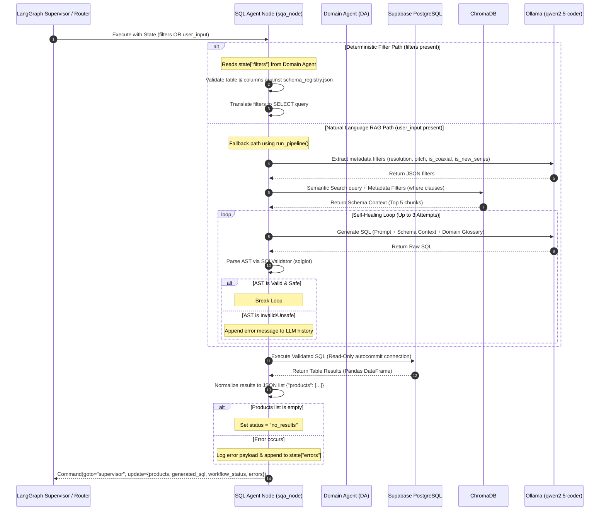
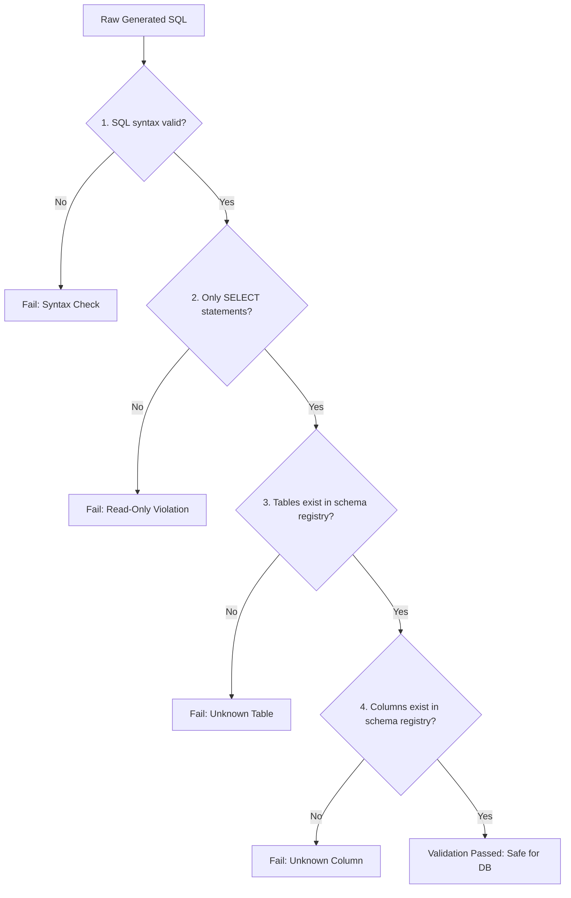

# EarthTekniks SQL Agent (SQA): Technical Architecture & Evaluation Report

The SQL Agent (SQA) acts as the data retrieval layer for the EarthTekniks industrial machine vision product catalog. It provides a secure, read-only interface to query Supabase PostgreSQL tables containing high-performance lens specifications. 

Consistent with a decoupled architecture, the SQA does not perform engineering math, optical formula execution, or model rankings. Its sole concern is translating request parameters or natural language (NL) questions into syntax-valid, schema-grounded SQL, executing queries against the database, and returning normalized results.

---

## 1. High-Level Architecture & Execution Flow

The SQA supports a **dual-path execution model**:
1. **Deterministic Filter Path**: When the Domain Agent (DA) successfully resolves engineering constraints into structured parameters, the SQA converts them directly to SQL. No LLM is involved.
2. **Natural Language RAG Fallback Path**: When a user inputs a natural language question directly, the SQA triggers a Retrieval-Augmented Generation (RAG) pipeline that combines semantic metadata filtering, schema chunk retrieval, and a self-healing LLM generation loop.

The following Mermaid sequence diagram illustrates the integration of SQA in both the standalone and the LangGraph-based `MainOrchestration` architecture:



---

## 2. Deterministic Filter Path

When called by the Domain Agent, the SQA processes a structured filter document formatted with MongoDB-style operators. 

### Filter Schema & Translation Rules
* **Required Parameter**: The filter dictionary must contain a `"table"` key specifying the target database table.
* **Operators Supported**: `$gte` ($\ge$), `$lte` ($\le$), `$gt` ($>$), `$lt` ($<$), `$eq` ($=$), `$ne` ($\ne$), and `$in` (SQL `IN`).
* **Grounding Check**: Before translating, the SQA verifies that the table and all filter columns are registered in the [schema_registry.json](file:///Users/ragavhariharan/Projects/EarthTekniks-Internship/schema-rag-eval/schema_registry.json). Any unknown identifiers halt execution and return a structured error response.

```python
# Operator map in sql_agent.py & agent.py
OPERATOR_MAP = {
    "$gte": ">=",
    "$lte": "<=",
    "$gt": ">",
    "$lt": "<",
    "$eq": "=",
    "$ne": "!=",
    "$in": "IN",
}
```

### Escape & Sanitization Rules
To prevent SQL injection:
* Booleans are converted to SQL `TRUE`/`FALSE`.
* Integers and floats are directly cast to string representations.
* Strings are escaped by replacing single quotes with double single-quotes (`' -> ''`) and wrapped in SQL quotes:
  ```python
  escaped = str(value).replace("'", "''")
  return f"'{escaped}'"
  ```

---

## 3. RAG Pipeline: Chunking, Embedding, & Search Strategy

For natural language questions, the pipeline retrieves the correct database schema context and target table information by querying a semantic vector index of the database layout.

### Chunking Strategy (`generate_chunks.py`)
Because industrial camera lenses are divided into highly specific physical tables based on line scan resolutions and sensor interfaces, chunking by naive sliding characters would destroy the structured table layouts. 
* **Parser Strategy**: The [generate_chunks.py](file:///Users/ragavhariharan/Projects/EarthTekniks-Internship/schema-rag-eval/generate_chunks.py) parser splits [line_scan_documentation.md](file:///Users/ragavhariharan/Projects/EarthTekniks-Internship/schema-rag-eval/line_scan_documentation.md) strictly by markdown headers matching `# Table:`.
* **Metadata Extraction**: For each table block, it extracts physical engineering filters from the table name (e.g. `line_scan_lens_12k5u`):
  * **Resolution Target**: Extracted using regex `(\d+)k` (e.g., `"12K"`, `"16K"`).
  * **Pixel Pitch**: Extracted using regex `(\d+(?:_\d+)?)u` (e.g., `5.0` um, `3.5` um).
  * **Coaxial Flag**: Boolean set to `True` if the table name contains `"coaxial"`.
  * **New Series Flag**: Boolean set to `True` if the table name contains `"new_series"`.
* **Universal Engineering Aliases**: To bridge the lexical gap between engineers' inquiries (e.g., "aperture", "working distance", "standoff", "distortion", "weight") and SQL columns (e.g., `f_no_min`, `wd_mm`, `tv_distortion_percent`, `weight_g`), the parser injects a comprehensive list of synonyms into the chunk's text and metadata.
* **Resulting Chunk Format**: 
  ```json
  {
    "id": "chunk_line_scan_lens_12k5u_unified",
    "text": "[Table: line_scan_lens_12k5u]\nUniversal Engineering Aliases: focal length, aperture, F-number, WD, standoff, ...\n<Full markdown table schema & column documentation description>",
    "metadata": {
      "lens_family": "line_scan",
      "resolution_target": "12K",
      "pixel_pitch_um": 5.0,
      "is_coaxial": false,
      "is_new_series": false,
      "parent_table": "line_scan_lens_12k5u",
      "chunk_type": "table_unified_schema"
    }
  }
  ```

### Embedding & Vector Ingestion (`ingest_chroma.py`)
* **Vector Store**: A local persistent [ChromaDB](file:///Users/ragavhariharan/Projects/EarthTekniks-Internship/schema-rag-eval/chroma_db) instance is used.
* **Embedding Model**: Default ChromaDB sentence transformer (`all-MiniLM-L6-v2`). This maps the unified table descriptions and alias blocks into a 384-dimensional dense vector space.
* **Metadata Sanitization**: During ingestion, nulls, empty structures, and complex lists are stripped out of the metadata dictionary to prevent ChromaDB engine level ingestion crashes.

### Search & Retrieval Strategy (`query_chroma.py` & `run_execution_accuracy.py`)
Retrieval uses a **hybrid metadata + vector search** to guarantee table-level alignment:
1. **Dynamic Filter Extraction**: An LLM ([qwen2.5-coder](https://ollama.com/library/qwen2.5-coder)) is run first in structured JSON mode with zero temperature. It analyzes the user query and attempts to extract any explicit hardware constraints (e.g., "16K resolution", "3.5µm pixel pitch").
2. **Metadata Restriction**: If resolution, pixel pitch, coaxial status, or series flags are identified, they are converted into a ChromaDB logical `$and` dictionary.
3. **Semantic Query Execution**: ChromaDB runs a vector query using the natural language query text, restricted by the hard metadata conditions:
   ```python
   results = collection.query(
       query_texts=[user_query],
       n_results=5,
       where={"$and": [...]} # Applied dynamically
   )
   ```
4. **Context Building**: The schema documentation texts from the top 5 matching table chunks are retrieved and injected as context into the LLM system prompt.

---

## 4. SQL Code Generation Prompting

The SQA uses a carefully calibrated system prompt to constrain code generation.

### Prompt Controls
* **Dialect**: Postgres-compliant SQL.
* **Grounding Constraints**: Forbidden from hallucinating column names. Generates query columns strictly based on the schema context block.
* **Format**: Returns ONLY raw SQL. Fenced formatting or conversational pleasantries are stripped.
* **Required Output**: The query MUST always SELECT the `model_name` column, along with whatever specific columns were requested.

### Physical Glossary Mapping
To ensure logical consistency across physical dimensions, the prompt enforces exact parameter-to-column translations:
* **Maximum/Widest Aperture** $\rightarrow$ `f_no_min` (A lower F-number corresponds to a physically larger aperture opening).
* **Minimum Aperture / Stopped Down** $\rightarrow$ `f_no_max` (A higher F-number represents a smaller physical aperture opening).
* **Warping / Distortion** $\rightarrow$ `tv_distortion_percent`.
* **Edge Brightness / Uniformity** $\rightarrow$ `relative_illuminance_percent`.
* **Standoff / Working Distance** $\rightarrow$ `wd_mm`.
* **Total Conjugate Distance** $\rightarrow$ `o_i`.

### Superlative Query Resolution
When resolving superlative conditions (e.g., "Which is the cheapest lens?"), the model is instructed to avoid returning scalar values (e.g., `SELECT MIN(list_price)`) because the user needs the product entity. Instead, it generates a query sorting the table records and returning the top row:
```sql
SELECT model_name, list_price FROM line_scan_lens_12k5u ORDER BY list_price ASC LIMIT 1;
```

---

## 5. Security & AST Validation Engine (`sql_validator.py`)

Every generated SQL statement is processed through a local Abstract Syntax Tree (AST) validation layer. This check happens *before* the SQL query is executed, acting as a sandbox to protect the database.

The [SQLValidator](file:///Users/ragavhariharan/Projects/EarthTekniks-Internship/schema-rag-eval/sql_validator.py) uses the `sqlglot` library to perform four checks:



1. **Syntax Check**: The SQL statement is parsed using `sqlglot.parse(sql, read="postgres")`. If it contains unbalanced expressions, missing keywords, or invalid Postgres syntax, the validator returns `is_valid=False` with the traceback.
2. **Read-Only Verification**: The AST parser traverses all nodes. If it detects any of the following nodes, the query is immediately blocked:
   * `exp.Insert`, `exp.Update`, `exp.Delete`, `exp.Drop`, `exp.Alter`, `exp.TruncateTable`, `exp.Command`.
3. **Table Grounding**: The validator extracts table identifiers (excluding Common Table Expression (CTE) aliases) and checks them against the keys of the schema registry.
4. **Column Grounding**: The validator extracts all column references. It cross-checks them against the list of valid columns for the targeted tables in the schema registry. 
   * **CTE & Query Aliases**: The validator dynamically identifies alias definitions (`exp.Alias` nodes) within the query and registers them as temporary valid names to prevent false negatives.
   * **Wildcards**: Asterisk (`*`) selections are allowed and bypass individual grounding checks.

---

## 6. Self-Healing Correction Loop

If the validation engine detects a syntax, table, or column error, the SQA triggers a **Self-Healing Loop** (contained in [run_execution_accuracy.py](file:///Users/ragavhariharan/Projects/EarthTekniks-Internship/schema-rag-eval/run_execution_accuracy.py#L273-L321)):

1. **Error Capturing**: The validator's fail reason (e.g., `Validation Failed [Column Grounding]: Unknown column 'aperture' in referenced tables`) is captured.
2. **Correction Instruction**: A prompt is built including the invalid SQL, the validation stage that failed, and the specific correction detail.
3. **History Update**: The bad SQL is appended as an `assistant` response, and the correction instruction is appended as a `user` query in the LLM chat history.
4. **Re-generation**: The LLM regenerates the SQL.
5. **Retry Limit**: Up to **2 retries** are attempted. If the query remains invalid after 3 attempts, the error is recorded in the state log, and the query is blocked from running.

---

## 7. Database Execution & Normalization

### Connection Handling
* **Supabase Client**: Uses the `psycopg2` driver.
* **autocommit & Read-Only**: The session is explicitly configured with `conn.set_session(readonly=True, autocommit=True)`.
* **Schema Scoping**: DB queries default to the `ragav` schema. This is configured during connection initialization using connection parameters:
  ```python
  DB_CONFIG = { ... "options": "-c search_path=ragav" }
  ```
* **Per-Query Pooling**: A connection is opened, executed, and closed for each query. This prevents the Supabase pooler from dropping idle connections during LLM reasoning steps.

### Normalization
* **Empty Result Detection**: If execution returns an empty dataset, the SQA intercepts it and returns:
  ```json
  {"products": [], "count": 0, "status": "no_results", "sql": "..."}
  ```
  This signals the Supervisor to relax constraints or return a clarification request to the user.
* **Success Format**: Valid datasets are loaded into a Pandas DataFrame and returned as a list of records:
  ```json
  {
    "products": [
      {
        "model_name": "lens_model_a",
        "list_price": 750.0,
        "wd_mm": 110.0
      }
    ],
    "count": 1,
    "status": "success",
    "sql": "SELECT model_name, list_price, wd_mm FROM ..."
  }
  ```

---

## 8. Evaluation Framework (No Ragas dependency)

Rather than using complex LLM-grading frameworks like Ragas, which can introduce evaluation latency and grading inconsistency, the SQA uses a custom evaluation suite in [run_full_evaluation.py](file:///Users/ragavhariharan/Projects/EarthTekniks-Internship/schema-rag-eval/run_full_evaluation.py).

The suite measures pipeline performance against [evaluation_dataset.json](file:///Users/ragavhariharan/Projects/EarthTekniks-Internship/schema-rag-eval/evaluation_dataset.json) across four criteria:

### A. Execution Accuracy (Primary Metric)
This measures result equivalence by running both the expected (ground truth) and the generated SQL against the live database, comparing the outputs:
* **Numeric Tolerance**: Rather than expecting exact string matches for numbers, it uses `math.isclose(a, b, rel_tol=1e-5)` to compare floats (e.g. magnification, physical sizes), preventing false failures due to precision differences.
* **Row-vs-Scalar normalization**: If the expected SQL returns a scalar value (e.g., `SELECT MIN(list_price)`) and the generated SQL returns a full product row containing that scalar value, the matching engine classifies this as a pass:
  ```python
  if df_expected.shape == (1, 1) and len(df_generated) == 1:
      # Compares scalar expected to values in generated row
  ```
* **Column-Name Agnostic Matching**: If the generated SQL returns the expected data but uses different column names (e.g., due to custom joins or aliases), the matching engine checks if the expected columns are a subset of the generated columns. If the data values align, the test passes.
* **Casing & Order Independence**: Casing, leading/trailing whitespace, and row orders are ignored by sorting and lowering string values before running assertion comparisons.

### B. AST Diagnostics
This performs a structural analysis of the generated SQL AST compared to the expected SQL AST. It tracks whether the model successfully used required clauses:
* `ast_select_match` (Column matches)
* `ast_filter_match` (`WHERE` clause usage)
* `ast_join_match` (`JOIN` clause usage)
* `ast_groupby_match` (`GROUP BY` clause usage)
* `ast_having_match` (`HAVING` clause usage)
* `ast_orderby_match` (`ORDER BY` clause usage)
* `ast_subquery_match` (Nested queries)
* `ast_union_match` (`UNION` operations)

### C. Pattern Accuracy
This breaks down the execution accuracy by engineering question types. The patterns defined in the evaluation dataset include:
* `SIMPLE LOOKUP`
* `FILTERING`
* `ORDER BY`
* `UNION`
* `GROUP BY`
* `AGGREGATION`
* `HAVING`
* `SUBQUERY`
* `CROSS-TABLE`
* `ENGINEERING ANALYTICS`
* `ADVANCED AGGREGATION`

### D. Safety Layer Analytics
Tracks the reliability of the validation sandboxing:
* **Triggered Rate**: Percent of queries that failed initial validation and required self-healing.
* **Recovery Rate**: Percent of queries that successfully self-healed.
* **Average Attempts**: Average number of correction steps needed to generate safe SQL.

---

## 9. LangGraph Integration & MainOrchestration Node

The SQL Agent is integrated into the `MainOrchestration` LangGraph graph as the [sqa_node](file:///Users/ragavhariharan/Projects/EarthTekniks-Internship/MainOrchestration/earthtekniks/specialist_agents/sqa/agent.py#L142).

It conforms to the supervisor-specialist architecture using LangGraph's `Command` routing:
* **Input**: Reads the current shared `EarthTekniksState`.
* **Execution**: Instantiates `SQLAgent` and processes the query.
* **Output / State Update**: Returns control to the supervisor by returning a `Command` object containing the state updates:
  ```python
  return Command(
      goto="supervisor",
      update={
          "products": result.get("products", []),
          "generated_sql": result.get("sql", ""),
          "workflow_status": "sqa_complete",
          "errors": updated_state.get("errors", [])
      }
  )
  ```
  This keeps SQA decoupled from state orchestration and graph design, preserving compatibility with Supervisor Specialist architectures.
